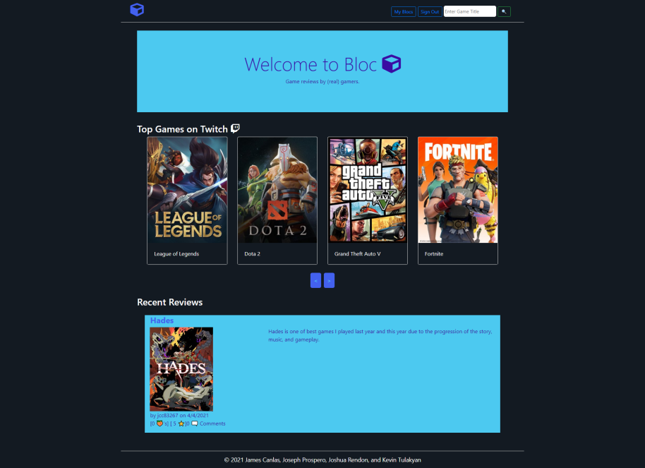

# Hrd-Cpy

## Description

Our goal is to create an application that allows gamers to share their thoughts and opinions on video game titles with peers. Bloc provides a platform for gamers to write reviews available to others who are curious or looking to purchase a game.

## CSS Framework

- Bootstrap

## Javascript Libraries

- JQuery

## Npm Packages

- bcrypt
- connect-session-sequelize 
- .env 
- express 
- express handlebars 
- express session 
- mysql2 
- node fetch 
- path
- sequelize
- jest
- nodemailer

## APIs

-[The Twitch API](https://dev.twitch.tv/docs/api/ "The Twitch API")

## Screenshot

## Credits

- James Canlas
<http://github.com/jcc83267> <jamescanlasjr@yahoo.com>

- Joseph Prospero
<https://github.com/josephprospero> <jprospero413@gmail.com>

- Joshua Rendon
<http://github.com/jmrendon48> <jmrendon48@gmail.com>

- Kevin Tulakyan
<http://github.com/KevinTulakyan> <kevintulakyan@gmail.com>
